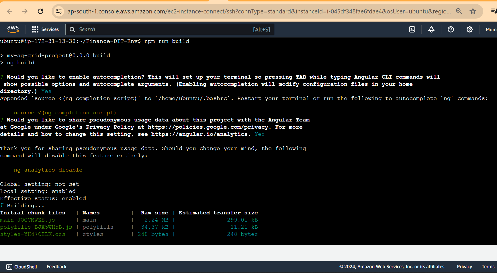

# Install Jenkins, set up cicd, Build Angular application

### prerequisites
##### git hub: https://github.com/RavindraSystima/Finance-DIT-Env.git
##### EC2 Server: ubuntu 22 OS
##### Installed Nodejs and ng angularcli
##### Artifact Jfrog
---
Creating AWS instance
---

## AWS EC2 Instance

- Go to AWS Console
- Instances(running)
- Launch instances


### Install Jenkins.

Pre-Requisites:
 - Java (JDK)

### Run the below commands to install Java and Jenkins

Install Java

```
sudo apt update
sudo apt install openjdk-11-jre
```

Verify Java is Installed

```
java -version
```

Now, you can proceed with installing Jenkins

```
curl -fsSL https://pkg.jenkins.io/debian/jenkins.io-2023.key | sudo tee \
  /usr/share/keyrings/jenkins-keyring.asc > /dev/null
echo deb [signed-by=/usr/share/keyrings/jenkins-keyring.asc] \
  https://pkg.jenkins.io/debian binary/ | sudo tee \
  /etc/apt/sources.list.d/jenkins.list > /dev/null
sudo apt-get update
sudo apt-get install jenkins
```

**Note: ** By default, Jenkins will not be accessible to the external world due to the inbound traffic restriction by AWS. Open port 8080 in the inbound traffic rules as show below.

- EC2 > Instances > Click on <Instance-ID>
- In the bottom tabs -> Click on Security
- Security groups
- Add inbound traffic rules as shown in the image (you can just allow TCP 8080 as well, in my case, I allowed `All traffic`).


### Login to Jenkins using the below URL:

http://<ec2-instance-public-ip-address>:8080    [You can get the ec2-instance-public-ip-address from your AWS EC2 console page]

Note: If you are not interested in allowing `All Traffic` to your EC2 instance
      1. Delete the inbound traffic rule for your instance
      2. Edit the inbound traffic rule to only allow custom TCP port `8080`
  
After you login to Jenkins, 
      - Run the command to copy the Jenkins Admin Password - `sudo cat /var/lib/jenkins/secrets/initialAdminPassword`
      - Enter the Administrator password
      


### Click on Install suggested plugins


Wait for the Jenkins to Install suggested plugins


Create First Admin User or Skip the step [If you want to use this Jenkins instance for future use-cases as well, better to create admin user]


Jenkins Installation is Successful. You can now starting using the Jenkins 


## Installed Nodejs 18 in jenkins server.


## and also installed angular ci and ng in the jenkins server in the same way.

## Excuted the code manually if its working fine.



### created a pipeline job

#### Here is my pipeline snippet reference


```
Note: There is some error in the code regarding the budget error for that we need to change code base in the angualr.json file so i have suppresed the error in the pipeline execution.

error: details:

```


## Here is the Jenkins file

```Jenkinsfile
pipeline {
    agent any
    options { 
        timeout(time: 30, unit: 'MINUTES') 
    }
    triggers {
        pollSCM('* * * * *')
    }
    stages {
        stage('git') {
            steps {
                git url: 'https://github.com/RavindraSystima/Finance-DIT-Env.git',
                branch: 'main'
            }
        }
        stage('build') {
            steps {
                dir('Finance-DIT-Env') {
                    script {
                        try {
                            sh 'npm install'
                            sh 'npm run build'
                        } catch (err) {
                            echo "Build failed, but continuing with the pipeline: ${err}"
                        }
                    }
                }
            }
        }
        stage('Artifact upload') {
            steps {
                script {
                    sh 'ls -la'
                    sh 'zip -r dist.zip dist'
                    // Assuming JFrog Artifactory credentials are already configured in Jenkins
                    // Replace 'Jfrog' with your credentialsId if it's different
                    withCredentials([usernamePassword(credentialsId: 'Jfrog', usernameVariable: 'USER', passwordVariable: 'PASS')]) {
                        sh 'curl -u $USER:$PASS -T dist.zip https://venkyorg.jfrog.io/artifactory/spc/PROD/$BUILD_NUMBER/'
                    }
                }
            }
        }
    }
}

```

##### Artifacts are being upload to Jfrog cloud account which is my personal account.

### Console output for your reference.

```
Started by user admin
[Pipeline] Start of Pipeline
[Pipeline] node
Running on Jenkins in /var/lib/jenkins/workspace/Finance-DIT-Env
[Pipeline] {
[Pipeline] timeout
Timeout set to expire in 30 min
[Pipeline] {
[Pipeline] stage
[Pipeline] { (git)
[Pipeline] git
The recommended git tool is: NONE
No credentials specified
 > git rev-parse --resolve-git-dir /var/lib/jenkins/workspace/Finance-DIT-Env/.git # timeout=10
Fetching changes from the remote Git repository
 > git config remote.origin.url https://github.com/RavindraSystima/Finance-DIT-Env.git # timeout=10
Fetching upstream changes from https://github.com/RavindraSystima/Finance-DIT-Env.git
 > git --version # timeout=10
 > git --version # 'git version 2.34.1'
 > git fetch --tags --force --progress -- https://github.com/RavindraSystima/Finance-DIT-Env.git +refs/heads/*:refs/remotes/origin/* # timeout=10
 > git rev-parse refs/remotes/origin/main^{commit} # timeout=10
Checking out Revision 4aa1f29138ae93244037eb4e86401a7962667fbe (refs/remotes/origin/main)
 > git config core.sparsecheckout # timeout=10
 > git checkout -f 4aa1f29138ae93244037eb4e86401a7962667fbe # timeout=10
 > git branch -a -v --no-abbrev # timeout=10
 > git branch -D main # timeout=10
 > git checkout -b main 4aa1f29138ae93244037eb4e86401a7962667fbe # timeout=10
Commit message: "Initial commit"
 > git rev-list --no-walk 4aa1f29138ae93244037eb4e86401a7962667fbe # timeout=10
[Pipeline] }
[Pipeline] // stage
[Pipeline] stage
[Pipeline] { (build)
[Pipeline] dir
Running in /var/lib/jenkins/workspace/Finance-DIT-Env/Finance-DIT-Env
[Pipeline] {
[Pipeline] script
[Pipeline] {
[Pipeline] sh
+ npm install

up to date, audited 978 packages in 3s

118 packages are looking for funding
  run `npm fund` for details

3 vulnerabilities (1 moderate, 2 high)

To address issues that do not require attention, run:
  npm audit fix

To address all issues (including breaking changes), run:
  npm audit fix --force

Run `npm audit` for details.
[Pipeline] sh
+ npm run build

> my-ag-grid-project@0.0.0 build
> ng build

- Building...

Initial chunk files   | Names         |  Raw size | Estimated transfer size
main-JOGCMWZE.js      | main          |   2.24 MB |               299.01 kB
polyfills-BJX5WH5B.js | polyfills     |  34.37 kB |                11.21 kB
styles-YH47CHLK.css   | styles        | 248 bytes |               248 bytes

                      | Initial total |   2.27 MB |               310.46 kB

Lazy chunk files      | Names         |  Raw size | Estimated transfer size
main-KRJQSZUD.css     | -             | 280.95 kB |                29.73 kB

Application bundle generation failed. [18.281 seconds]
▲ [WARNING] bundle initial exceeded maximum budget. Budget 500.00 kB was not met by 1.79 MB with a total of 2.27 MB.


▲ [WARNING] node_modules/ag-grid-community/styles/ag-grid.css exceeded maximum budget. Budget 2.00 kB was not met by 279.09 kB with a total of 281.09 kB.


▲ [WARNING] node_modules/ag-grid-community/styles/ag-grid.css exceeded maximum budget. Budget 2.00 kB was not met by 279.14 kB with a total of 281.14 kB.


✘ [ERROR] bundle initial exceeded maximum budget. Budget 1.00 MB was not met by 1.27 MB with a total of 2.27 MB.


✘ [ERROR] node_modules/ag-grid-community/styles/ag-grid.css exceeded maximum budget. Budget 4.00 kB was not met by 277.09 kB with a total of 281.09 kB.


✘ [ERROR] node_modules/ag-grid-community/styles/ag-grid.css exceeded maximum budget. Budget 4.00 kB was not met by 277.14 kB with a total of 281.14 kB.


[Pipeline] echo
Build failed, but continuing with the pipeline: hudson.AbortException: script returned exit code 1
[Pipeline] }
[Pipeline] // script
[Pipeline] }
[Pipeline] // dir
[Pipeline] }
[Pipeline] // stage
[Pipeline] stage
[Pipeline] { (Artifact upload)
[Pipeline] script
[Pipeline] {
[Pipeline] sh
+ ls -la
total 1076
drwxr-xr-x  11 jenkins jenkins   4096 Mar 16 07:00 .
drwxr-xr-x  18 jenkins jenkins   4096 Mar 16 06:53 ..
-rw-r--r--   1 jenkins jenkins    274 Mar 16 06:31 .editorconfig
drwxr-xr-x   8 jenkins jenkins   4096 Mar 16 07:00 .git
-rw-r--r--   1 jenkins jenkins    548 Mar 16 06:31 .gitignore
drwxr-xr-x   2 jenkins jenkins   4096 Mar 16 06:31 .vscode
drwxr-xr-x   2 jenkins jenkins   4096 Mar 16 06:31 Finance-DIT-Env
drwxr-xr-x   2 jenkins jenkins   4096 Mar 16 07:00 Finance-DIT-Env@tmp
-rw-r--r--   1 jenkins jenkins   1069 Mar 16 06:31 README.md
-rw-r--r--   1 jenkins jenkins   2664 Mar 16 06:41 angular.json
drwxr-xr-x   3 jenkins jenkins   4096 Mar 16 06:32 dist
-rw-r--r--   1 jenkins jenkins 505118 Mar 16 06:59 dist.zip
drwxr-xr-x   2 jenkins jenkins   4096 Mar 16 06:52 finance-dit-env
drwxr-xr-x   2 jenkins jenkins   4096 Mar 16 06:55 finance-dit-env@tmp
drwxr-xr-x 562 jenkins jenkins  20480 Mar 16 07:00 node_modules
-rw-r--r--   1 jenkins jenkins 498321 Mar 16 07:00 package-lock.json
-rw-r--r--   1 jenkins jenkins   1330 Mar 16 06:31 package.json
drwxr-xr-x   4 jenkins jenkins   4096 Mar 16 06:31 src
-rw-r--r--   1 jenkins jenkins    263 Mar 16 06:31 tsconfig.app.json
-rw-r--r--   1 jenkins jenkins    903 Mar 16 06:31 tsconfig.json
-rw-r--r--   1 jenkins jenkins    273 Mar 16 06:31 tsconfig.spec.json
[Pipeline] sh
+ zip -r dist.zip dist
updating: dist/ (stored 0%)
updating: dist/my-ag-grid-project/ (stored 0%)
updating: dist/my-ag-grid-project/browser/ (stored 0%)
updating: dist/my-ag-grid-project/browser/styles-YH47CHLK.css (deflated 59%)
updating: dist/my-ag-grid-project/browser/main-KRJQSZUD.css (deflated 86%)
updating: dist/my-ag-grid-project/browser/main-JOGCMWZE.js (deflated 81%)
updating: dist/my-ag-grid-project/browser/index.html (deflated 47%)
updating: dist/my-ag-grid-project/browser/assets/ (stored 0%)
updating: dist/my-ag-grid-project/browser/assets/jsons/ (stored 0%)
updating: dist/my-ag-grid-project/browser/assets/jsons/master-detail-data.json (deflated 85%)
updating: dist/my-ag-grid-project/browser/favicon.ico (deflated 72%)
updating: dist/my-ag-grid-project/browser/polyfills-BJX5WH5B.js (deflated 64%)
updating: dist/my-ag-grid-project/3rdpartylicenses.txt (deflated 68%)
[Pipeline] withCredentials
Masking supported pattern matches of $USER or $PASS
[Pipeline] {
[Pipeline] sh
+ curl -u ****:**** -T dist.zip https://venkyorg.jfrog.io/artifactory/spc/PROD/15/
  % Total    % Received % Xferd  Average Speed   Time    Time     Time  Current
                                 Dload  Upload   Total   Spent    Left  Speed

  0     0    0     0    0     0      0      0 --:--:-- --:--:-- --:--:--     0
  0  493k    0     0    0     0      0      0 --:--:-- --:--:-- --:--:--     0
  0  493k  100   138    0     0    166      0 --:--:-- --:--:-- --:--:--   166
<html>
<head><title>302 Found</title></head>
<body>
<center><h1>302 Found</h1></center>
<hr><center>nginx</center>
</body>
</html>
[Pipeline] }
[Pipeline] // withCredentials
[Pipeline] }
[Pipeline] // script
[Pipeline] }
[Pipeline] // stage
[Pipeline] }
[Pipeline] // timeout
[Pipeline] }
[Pipeline] // node
[Pipeline] End of Pipeline
Finished: SUCCESS

```


